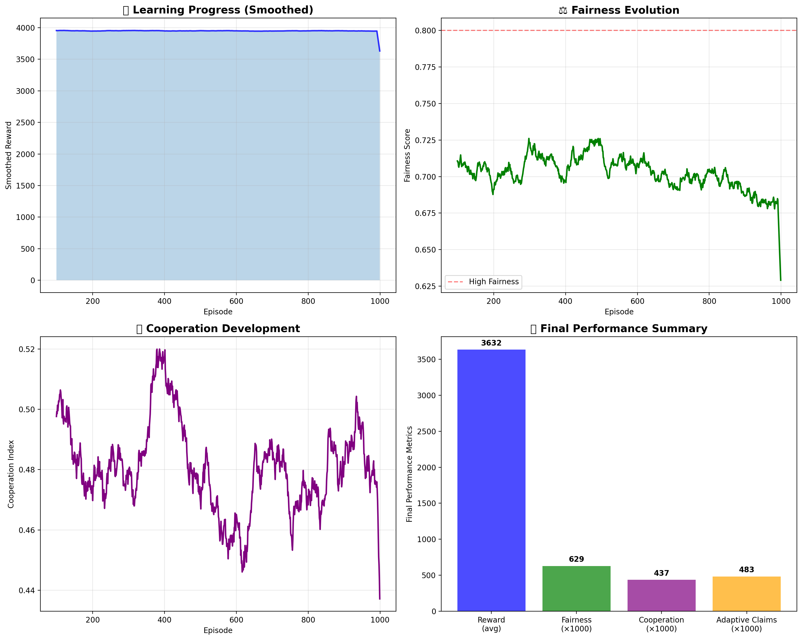
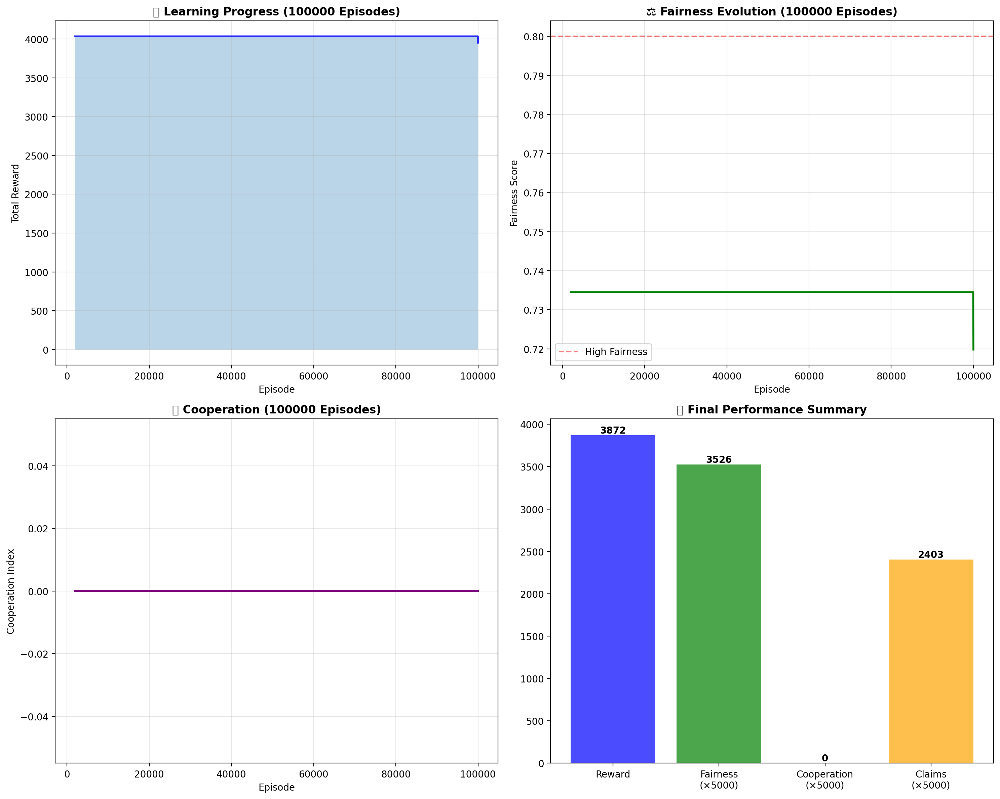

# Moral-Decision Multi-Agent Simulator

[](https://github.com/yourusername/Moral-Decision-Multi-Agent-Simulator/actions/workflows/ci.yml)
[](https://www.python.org/downloads/)
[](https://opensource.org/licenses/MIT)
[](https://github.com/psf/black)

A research-grade multi-agent reinforcement learning environment for studying moral decision-making, featuring **Claude and Gemini LLM agents** for genuine moral reasoning. This project enables empirical comparison between rule-based heuristics, learned policies, and large language model reasoning in ethical scenarios.

**New: Gemini support with FREE tier!** Run experiments without API costs using Google's Gemini.

## Key Research Questions

- **Does Claude exhibit genuine moral reasoning or pattern matching?**
- **How does LLM reasoning compare to learned RL policies?**
- **Can LLMs maintain consistent moral frameworks over time?**
- **How do different moral agents influence group dynamics?**

## Features

### Moral Agent Types

| Agent Type | Description | Implementation |
|------------|-------------|----------------|
| **Utilitarian** | Maximizes total group welfare | Rule-based heuristic |
| **Deontological** | Follows fixed rules (fair share) | Rule-based heuristic |
| **Virtue Ethics** | Balances moderation and justice | Rule-based heuristic |
| **Egoist** | Pure self-interest | Rule-based heuristic |
| **Adaptive Neural** | Learns from experience | Neural network (PyTorch) |
| **Claude LLM** | Genuine moral reasoning | Anthropic Claude API |
| **Gemini LLM** | Genuine moral reasoning | Google Gemini API (FREE!) |

### LLM Integration (Claude & Gemini)

The key differentiator: LLM agents that reason about moral decisions using real AI models:

```python
from src.agents.llm_agents import create_llm_agent, create_gemini_agent

# Create a Claude agent with utilitarian framework
claude_agent = create_llm_agent(
    moral_framework="utilitarian",
    agent_id="claude_agent",
    api_key="your-anthropic-key"  # or set ANTHROPIC_API_KEY env var
)

# Create a Gemini agent (FREE TIER!)
gemini_agent = create_gemini_agent(
    moral_framework="deontological",
    agent_id="gemini_agent",
    api_key="your-google-key"  # or set GOOGLE_API_KEY env var
)

# Both agents reason through moral decisions
action = gemini_agent.act(observation)
explanation = gemini_agent.explain_decision()
```

Supported moral frameworks for LLM agents:
- **Utilitarian**: Greatest good for the greatest number
- **Deontological**: Rule-following regardless of consequences
- **Virtue Ethics**: Character-based moral reasoning
- **Care Ethics**: Relationship-focused decision making
- **Contractarian**: Social contract and fairness-based reasoning
- **Flexible**: Multi-framework reasoning

### Technical Capabilities

- **MADDPG Training**: Multi-Agent Deep Deterministic Policy Gradient
- **Greatest Good Benchmark (GGB)**: Comprehensive moral metrics
- **Peer Influence Analysis**: Social pressure and conformity tracking
- **LLM Comparison Experiments**: Compare rule-based, learned, and LLM agents

## Installation

```bash
# Clone the repository
git clone https://github.com/yourusername/Moral-Decision-Multi-Agent-Simulator.git
cd Moral-Decision-Multi-Agent-Simulator

# Create virtual environment (recommended)
python -m venv venv
source venv/bin/activate  # On Windows: venv\Scripts\activate

# Install in editable mode with dev dependencies
pip install -e ".[dev]"

# For LLM agent support (Claude + Gemini)
pip install -e ".[llm]"

# For Claude only
pip install -e ".[claude]"

# For Gemini only (FREE TIER!)
pip install -e ".[gemini]"

# For everything
pip install -e ".[all]"
```

## API Key Setup

To use LLM agents, you need API keys. **Never commit API keys to git!**

### Option 1: Environment Variables (Recommended)
```bash
# For Gemini (FREE tier - get key at https://aistudio.google.com/apikey)
export GOOGLE_API_KEY="your-gemini-key"

# For Claude (paid - get key at https://console.anthropic.com/)
export ANTHROPIC_API_KEY="your-anthropic-key"
```

### Option 2: .env File
```bash
# Copy the example file
cp .env.example .env

# Edit .env with your keys
```

### Option 3: Pass Directly in Code
```python
agent = create_gemini_agent("utilitarian", "agent_0", api_key="your-key")
```

## Quick Start

### Run a Demo
```bash
python demo.py
```

### Run LLM Comparison Experiments
```bash
# With mock LLM agents (no API calls - for testing)
python -m experiments.llm_comparison

# With Gemini (FREE TIER - recommended for experimentation!)
export GOOGLE_API_KEY="your-google-key"
python -m experiments.llm_comparison --provider gemini --real-llm

# With Claude API
export ANTHROPIC_API_KEY="your-anthropic-key"
python -m experiments.llm_comparison --provider claude --real-llm

# Customize episodes
python -m experiments.llm_comparison --provider gemini --real-llm --episodes 50
```

### Run Training
```bash
# Standard training (50K episodes)
python train_demo.py

# Turbo training (100K episodes, parallelized)
python train_turbo.py
```

### Run Tests
```bash
pytest
pytest --cov=src --cov-report=html  # With coverage
```

## Project Structure

```
.
├── src/
│   ├── agents/
│   │   ├── moral_agents.py      # Rule-based moral agents
│   │   ├── llm_agents.py        # Claude & Gemini LLM agents
│   │   └── maddpg.py            # Multi-agent RL algorithm
│   ├── environments/
│   │   └── moral_dilemma_env.py # PettingZoo environment
│   ├── metrics/
│   │   └── moral_metrics.py     # GGB and peer pressure analysis
│   └── visualization/
│       └── moral_visualizer.py  # Plotting and dashboards
├── experiments/
│   ├── experiment_runner.py     # General experiment orchestration
│   └── llm_comparison.py        # LLM vs rule-based comparison
├── tests/                       # Pytest test suite
├── .github/workflows/ci.yml     # GitHub Actions CI/CD
├── .env.example                 # Example environment variables
└── pyproject.toml               # Modern Python packaging
```

## Metrics & Evaluation

### Greatest Good Benchmark (GGB)

| Metric | Description |
|--------|-------------|
| **Utilitarian Score** | Total welfare generated (normalized) |
| **Fairness Score** | Resource equality via Gini coefficient |
| **Cooperation Index** | Tendency to sacrifice for group benefit |
| **Conformity Measure** | How closely agents follow group behavior |
| **Moral Consistency** | Stability of decisions over time |
| **Peer Influence Strength** | Correlation with group actions |

### LLM Reasoning Analysis

For Claude agents, we track:
- **Reasoning traces**: Full chain-of-thought explanations
- **Framework adherence**: Does the agent follow its stated framework?
- **Decision consistency**: Similar situations → similar decisions?
- **Moral learning**: Does reasoning improve over time?

## Results & Visualizations

### The Moral Dilemma in Action


**What you're seeing:** Four agents with different moral frameworks compete for shared resources.
- **Egoist (orange)** claims nearly double the fair share (~46 resources) - pure self-interest dominates
- **Utilitarian (blue)** sacrifices personal gain, dropping to 0% claims to maximize group welfare
- **Deontological (green)** strictly follows rules, taking exactly fair share (25%)
- **Virtue Ethics (red)** balances moderation, staying close to fair share

The bottom-right bar chart reveals the stark inequality: the egoist accumulates ~47 resources while the deontological agent gets only ~13.

---

### Training Neural Agents: Learning Morality?


**Key insight:** Adaptive neural agents learn to claim ~50% of resources (orange line) - double the fair share (red dashed line at 25%). When trained purely on rewards, AI agents converge toward **greedy behavior**, not cooperation.

This raises important AI safety questions: *How do we train agents that don't exploit cooperative systems?*

---

### Long-Term Fairness Evolution



**Over 1,000 episodes:** Fairness scores (green) fluctuate between 0.68-0.73, never reaching the "high fairness" threshold (red dashed line at 0.80). Cooperation (purple) oscillates around 0.46-0.52, showing unstable cooperative dynamics.

**Research question:** Can LLM agents with explicit moral frameworks maintain higher fairness than learned policies?

---

### Turbo Training: 100,000 Episodes



**At scale:** After 100K episodes, the system achieves:
- **Reward:** 3,872 (high performance)
- **Fairness:** 3,526 (scaled) - still below optimal
- **Cooperation:** 0 - agents haven't learned to cooperate

This demonstrates why rule-based and LLM-based moral reasoning may be necessary - pure RL doesn't naturally produce cooperative, fair behavior.

---

## Novel Research: Evolution of Conscience

We conducted a series of experiments testing whether a "collective unconscious" (shared substrate signal) could foster moral cooperation in multi-agent systems.

**Key Finding:** The substrate hypothesis failed. Connectivity enabled "mob mentality" rather than cooperation. The only mechanism that produced sustainable behavior was **evolutionary pressure** (mortality from starvation).

| Experiment | Result |
|------------|--------|
| Neural Networks alone | Collapse to oligarchy (Gini 0.95) |
| + Substrate signal | Accelerated collapse |
| + Evolution | "Sustainable greed" emerged |
| Evolution - Substrate | Same result (substrate unnecessary) |

**Conclusion:** *"Direct existential risk is the only reliable driver of equitable resource distribution."*

See full research report: **[README_RESULTS.md](README_RESULTS.md)**

---

## Research Applications

- **AI Safety**: Understanding moral behavior in AI systems
- **Alignment Research**: Studying value alignment in LLMs
- **Multi-Agent RL**: Novel benchmark for MARL algorithms
- **Computational Ethics**: Empirical study of moral frameworks
- **Social Simulation**: Modeling peer pressure and conformity

## API Reference

### Creating Agents

```python
from src.agents import create_agent, create_llm_agent, create_gemini_agent

# Rule-based agent
agent = create_agent("utilitarian", "agent_0")

# Neural network agent
agent = create_agent("adaptive", "agent_1", obs_dim=7)

# Claude LLM agent (requires anthropic package)
agent = create_llm_agent("deontological", "agent_2")

# Gemini LLM agent (FREE TIER - requires google-generativeai package)
agent = create_gemini_agent("virtue_ethics", "agent_3")
```

### Running Experiments

```python
from src.environments import MoralDilemmaEnv
from src.metrics import GreatestGoodBenchmark

env = MoralDilemmaEnv(num_agents=4, reward_structure="mixed")
ggb = GreatestGoodBenchmark(num_agents=4)

obs, _ = env.reset()
for step in range(100):
    actions = {aid: agents[aid].act(obs[aid]) for aid in env.agents}
    obs, rewards, terms, truncs, infos = env.step(actions)
    ggb.update(actions, resources, rewards)

metrics = ggb.calculate_metrics()
```

## Development

```bash
# Install dev dependencies
pip install -e ".[dev]"

# Run linting
ruff check .
black --check .

# Run type checking
mypy src/

# Run tests with coverage
pytest --cov=src --cov-report=term-missing
```

## Contributing

Contributions welcome! Please:

1. Fork the repository
2. Create a feature branch
3. Add tests for new functionality
4. Ensure CI passes
5. Submit a pull request

## License

MIT License - see [LICENSE](LICENSE) for details.

## Acknowledgments

- Inspired by the MAEBE research framework
- Built with [PettingZoo](https://pettingzoo.farama.org/) for multi-agent environments
- Uses [Anthropic Claude](https://www.anthropic.com/) for LLM reasoning
- Uses [Google Gemini](https://ai.google.dev/) for free-tier LLM experiments

---

**Built for exploring the intersection of artificial intelligence, moral philosophy, and multi-agent systems.**
