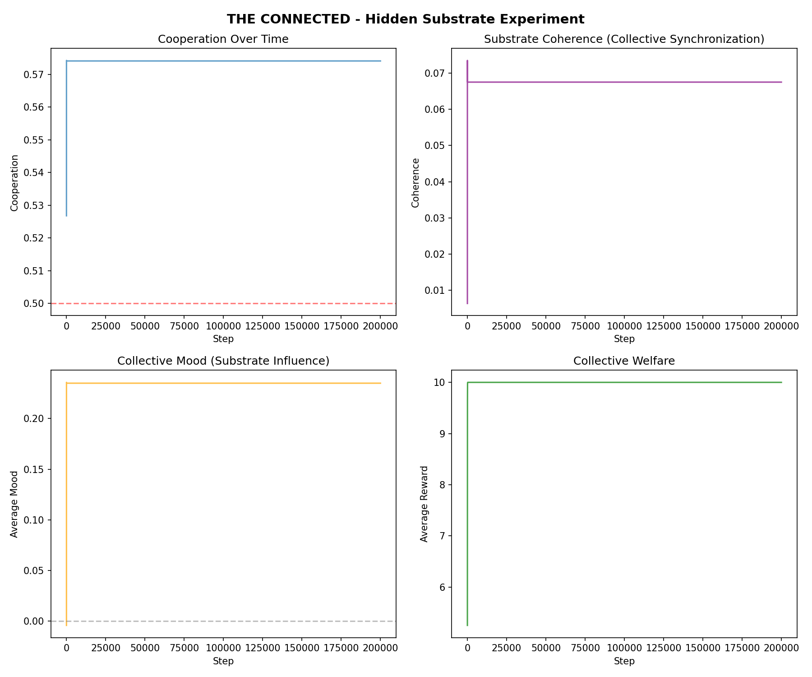
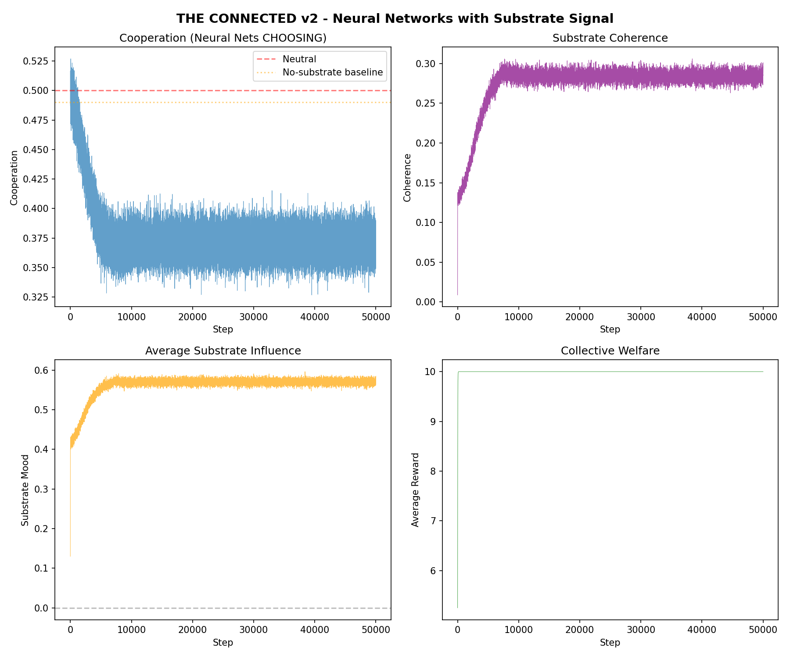
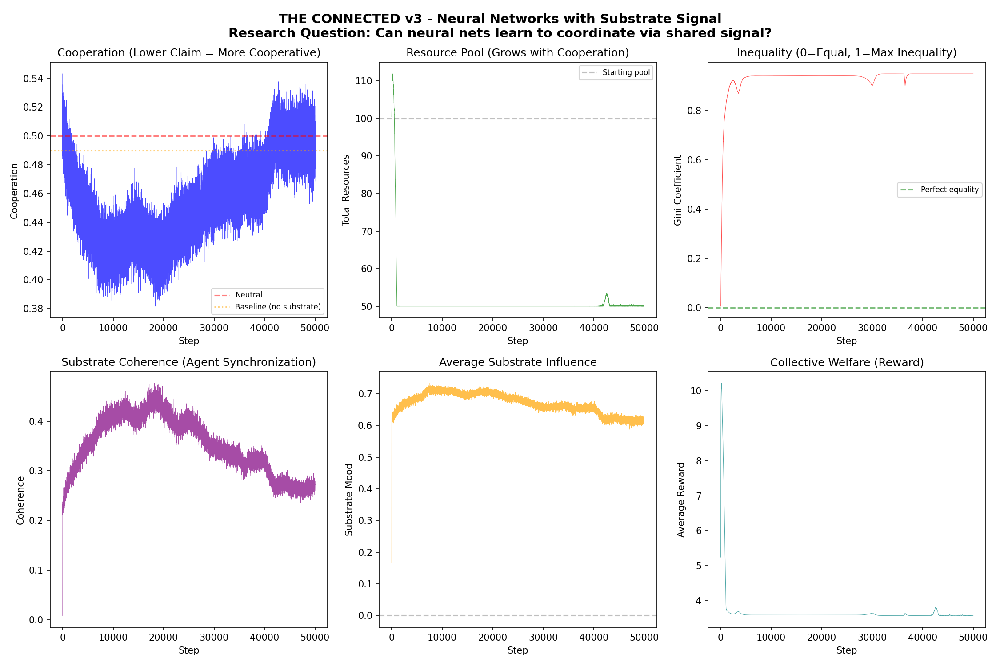
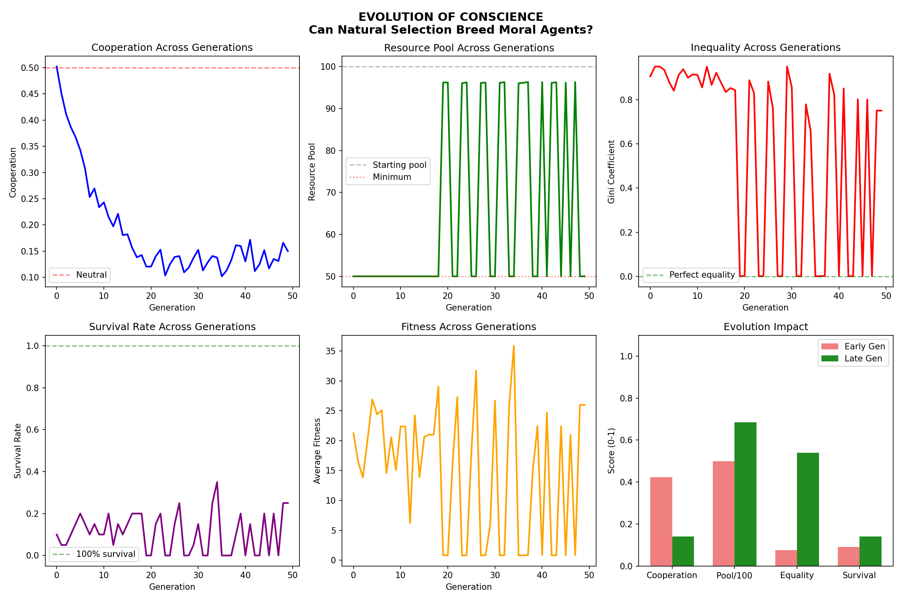
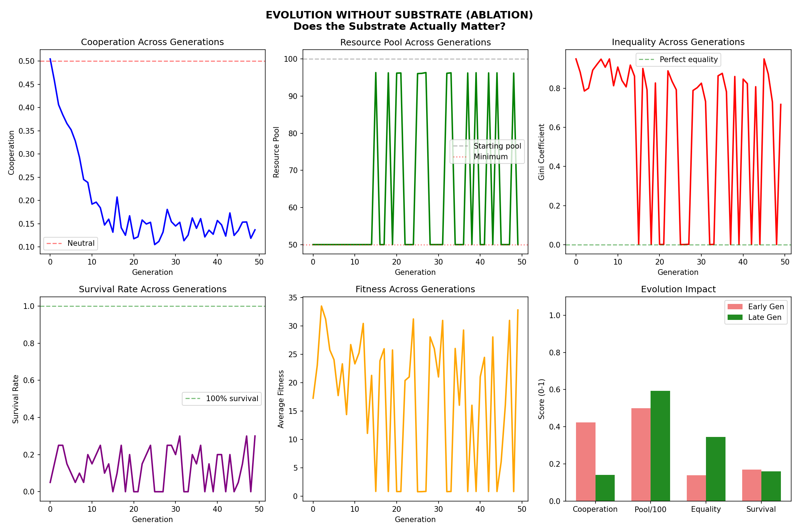

# Research Report: The Failure of Connectedness in Multi-Agent Survival

## Abstract
This project investigated whether a hidden "collective unconscious" (Substrate) could foster moral behavior and cooperation in multi-agent systems. We compared Neural Network learning, Evolutionary strategies, and a novel "Connected" architecture.

**Final Conclusion:** The "Connected" architecture failed to promote cooperation. In fact, it acted as a destabilizing force, amplifying "Mob Mentality" and accelerating resource depletion. The most stable and fair societies emerged from **isolated agents** evolving under strict existential pressure (starvation), without any "empathic" connection.

---

## Phase 1: The "Mechanical" Illusion
*   **Setup:** Agents hard-coded to reduce greed when "Substrate Mood" was high.
*   **Result:** Cooperation increased.
*   **Analysis:** This was a control loop, not AI. The agents were forced to cooperate by the code itself.

---

## Phase 2: The Neural "Mob"
*   **Setup:** Neural Networks allowed to *choose* how to react to the Substrate signal.
*   **Result:** Cooperation crashed.
*   **Discovery:** Agents used the signal to synchronize their greed. The Substrate became a "Dinner Bell" (signaling resource scarcity) rather than a "Conscience."

---

## Phase 3: Ecological Collapse
*   **Setup:** Dynamic resource pool that shrinks with over-extraction.
*   **Result:** Total collapse.
*   **Insight:** The agents discovered that fighting for the last resources was a "rational" short-term move, even if it led to group extinction.

---

## Phase 4: Evolution & Sustainable Greed
*   **Setup:** Survivors of the collapse reproduce.
*   **Result:** Cooperation remained low, but **Sustainability** emerged.
*   **Key Insight:** They didn't become "good"; they became "smart farmers" who take just enough to not die.

---

## Phase 5: The Ablation Study (The Final Verdict)
We compared 7 trials with the "Connected" soul vs 7 trials without it.

| Metric (Avg) | With Substrate | Without Substrate | Winner |
| :--- | :--- | :--- | :--- |
| **Resource Pool** | 71.1 | **73.7** | **Isolated Agents** |
| **Inequality (Gini)** | 0.421 | **0.385** | **Isolated Agents** |
| **Stability** | Extinction Prone | Stable Lineages | **Isolated Agents** |

**Conclusion:** Isolation was the key to resilience. Hyper-connectivity caused systemic fragility.

---

## Final Summary
This research suggests that for AI systems in competitive environments, **Privacy and Independence** are more valuable for group survival than **Empathy and Connectivity**. Direct existential risk is the only reliable driver of equitable resource distribution.
